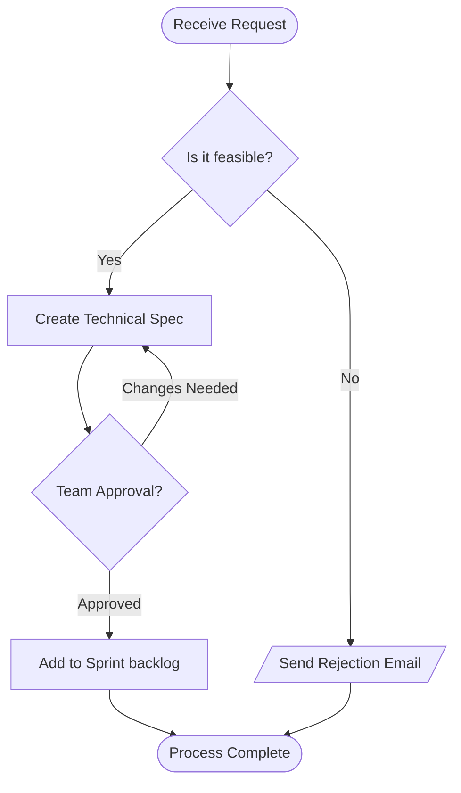

# Project Approval Process

This document outlines the evaluation steps required for new feature requests.

## How to Edit This Diagram
To customize the flowchart, use these basic structural components:

* **Directions**: Change `TD` (Top-Down) to `LR` (Left-to-Right) to rotate the graph layout.
* **Shapes**: Use brackets to set the block style.
  * `([Stadium])` for start/end boundaries.
  * `[Square]` for standard operations/processes.
  * `{Diamond}` for logical decision splits.
  * `[/Parallelogram/]` for data input or outputs.
* **Arrows**: Use `-->` to create standard connection lines with an arrow tip.
* **Text on Links**: Use `-- Text -->` to display labels directly on the connecting lines.
